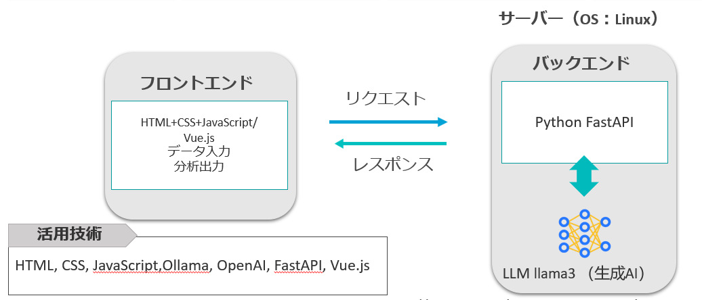

# GenAI-for-Manager(Manager GPT)

プロジェクト作者：楊 沢華、徐 遠楓、原田 諒、角田 大司郎

## インターシップの貢献：
楊　沢華：

- ~~Vue.jsを使って、スーパーマーケットのデータ管理システムのフロントエンド開発した。~~
~~（ログインとログアウト、データvisualization、ManagerGPTの機能実現する、データ管理。）~~
- ~~LLMの回答によって、Dashboradのデータvisualization調整。~~　
（システムに関する内容がチームメンバーに対する難しすぎたため、開発は行ったものの、チームが理解するのが困難でした。最終の発表には、ManagerGPTの対話機能のみを使用しました。）
- 使用した開発ツールのデザイン。
- バックエンドのFast APIの開発。
- test.htmlの中でJavaScriptを使って、バックエンドにRequestとフロントエンドにResponseの開発。
- サーバでOllamaを使って、日本語のLLM　APIの開発。
- LLMのプロンプトエンジニアリング(prompt engineering)
- 入力データ探して、データモデリング。
- チーム内のグループワークの開発環境作成（githubのRepositories）
- パワーポイントとソースコード整理とアップロード
- README.mdの作成。

徐 遠楓：UI、UXデザイン。

角田 大司郎：チーム間での役割分担、定期的な意見交換。

原田 諒: test.htmlの中でHTML＋CSS静的ウェブページの開発。

共通貢献：
一緒にDesign thinking。パワーポイントの制作。

## 紹介
マネージャーGPTは、中規模のスーパーマーケットを含む流通業のマネージャーがデータ管理、分析、及び分析結果の生成を行うためのウェブベースの管理システムです。
<iframe width="560" height="315" src="https://github.com/user-attachments/assets/46e09447-b4f4-4315-aa82-6a55ced99021" frameborder="0" allow="accelerometer; autoplay; clipboard-write; encrypted-media; gyroscope; picture-in-picture" allowfullscreen></iframe>

## 開発環境


### API test

まずは、Terminalに以下の内容を入力。
```python
uvicorn Hugging_face:app --host 0.0.0.0 --port 5000 #Ollama環境がない場合。
uvicorn LLMAPI:app --host 0.0.0.0 --port 5000　#Ollama環境がある場合。
```
ブラウザで test.html を開く。test.html（Fast APIのテスト，HTML+CSS+Javascript）
{width=400}{width=300}

### フロントエンド(UI/UX)
HTML＋CSS+JavaScript
**Framewrok**: vue.js, node.js
```
cd first_vue3_admin11
npm run dev
```
### 


### バックトエンド
- [x] FastAPI
- [x] [Ollama](https://ollama.com/)
- [x] OpenAI
- [x] [Llama-3-ELYZA-JP-8B(Llama 3 の日本語継続事前学習モデル)](https://huggingface.co/elyza/Llama-3-ELYZA-JP-8B)
- [x] Gemini(Ollama環境がない場合は、Hugging_face.pyを使っています。)

バックエンドのAPIについて：
LLMAPI.pyは、自分のPCやサーバーでOllamaを利用し、LLMであるLlama-3-ELYZA-JP-8Bをデプロイして使用することができます。
GUIが利用できない環境では、Hugging_face.pyを使用してください。このプログラムはGeminiのAPIを利用しており、自分のPC環境を必要としません。
Terminalに以下の内容を入力。
```python
uvicorn Hugging_face:app --host 0.0.0.0 --port 5000 #Ollama環境がない場合。
uvicorn LLMAPI:app --host 0.0.0.0 --port 5000　#Ollama環境がある場合。
```


### スーパーマーケットのデータ
URL:http://www.j-sosm.jp/dl/index.html


### TODO

- [x]　パワーポイントとソースコード整理とアップロード
